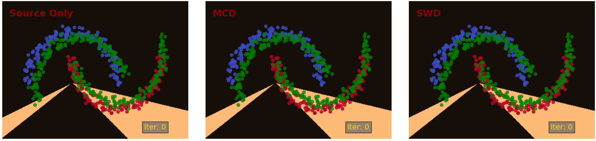

## Sliced Wasserstein Discrepancy for Unsupervised Domain Adaptation

[IEEE Conference on Computer Vision and Pattern Recognition (CVPR), 2019.](http://cvpr2019.thecvf.com)

[[Paper]](https://arxiv.org/abs/1903.04064)

## Introduction
In this work, we connect two distinct concepts for unsupervised domain adaptation: feature distribution alignment between domains by utilizing the task-specific decision boundary and the Wasserstein metric. The proposed method is designed to work with high-dimensional/structured outputs where the probability measures do not have significant overlap. For example image classification for high number of classes, semantic segmentation, and object detection.

The code here is a basic illustration of the implementation for the [intertwining
moons 2D dataset](https://scikit-learn.org/stable/modules/generated/sklearn.datasets.make_moons.html). 
For the source samples, we generate an upper moon (blue points) and a lower moon (red points), labeled 0 and 1, respectively. The target samples are generated from the same distribution as the source samples but with added domain shifts by rotation and translation. The model consists of a 3-layered fully-connected network for a feature generator and 3-layered fully-connected networks for classifiers.

This is for demonstration purposes only. Please see the paper for more details.

## Getting Started
This code is designed to work with Python 2.7.10.
Virtualenv is recommended.
Use pip to install dependencies
```
pip install -r requirements.txt
```
To run the demo in Python 3, please modify the requirements.txt with tensorflow==1.13.1 and matplotlib==3.1.0

## Running the code
To run the demo with adaptation:
```
python swd.py -mode adapt_swd
```

To run the demo without adaptation:
```
python swd.py -mode source_only
```

## Interpreting Outputs
Outputs will be saved as png and gif files in the current folder for each mode.
The outputs show the source and target samples with the current decision boundary.
&nbsp;<br />

